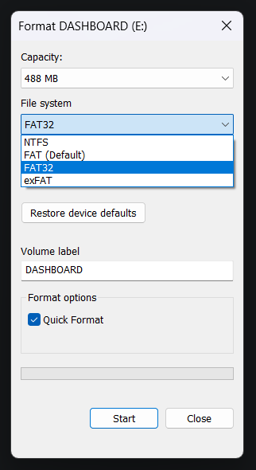

# Error 1101 - No SD Card Found

Page Navigator

<ul style="list-style: '▶  '"><li><a href="https://github.com/smolinde/iot-dashboard">Main Page</a></li>
<li><a href="https://github.com/smolinde/iot-dashboard/tree/master/errors">Error Pages</a></li>
<li><a href="https://github.com/smolinde/iot-dashboard/issues">Other Issues</a></li></ul>

 

If this error appears on your screen, there are three main reasons what could have happened:

1) The SD card reader of the ILI9488 display is not properly soldered to the ESP32-S3 Nano board
2) The SD card is not inserted
3) The SD card has the wrong format (not FAT32) or is corrupted

Please rule out the first reason by double-checking <a href="">this wiring diagram</a>. If everything seems fine, proceed with the second possible reason and double-check if the SD card is in place. Third reason could be due to wrong SD card formatting. Please make sure that your SD card is formatted as a FAT32 file system. Otherwise, it will not work. Under Windows 11, right-click your SD card in the file explorer, select "Format...", and select "FAT32" in "File system" drop-down menu, as shown in the following screenshot:  

Click "Start", and after the process has finished, copy all required files to the SD card as explained <a href="">here</a>.  

If this page still did not resolve the problem, feel free to open a [new issue](https://github.com/smolinde/iot-dashboard/issues/new?template=BLANK_ISSUE). The project maintainer will try to respond to it as soon as possible.