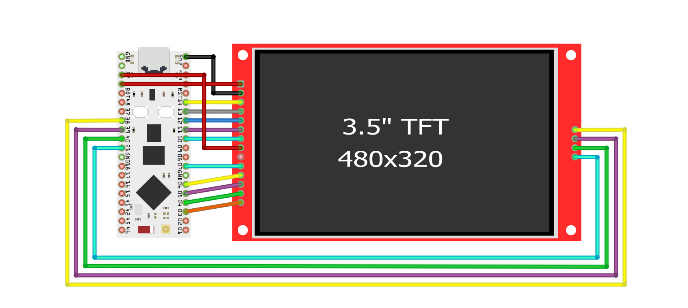
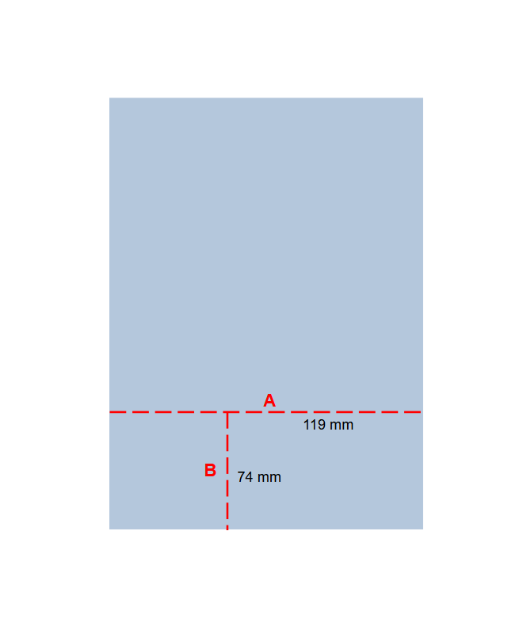

# Hardware Setup
← [Homepage](../)
## 1 Shopping List
For this project, you will need the following items:

- [3.5" TFT SPI LCD Display (ILI9488) with touch](https://de.aliexpress.com/item/1005004995246210.html)
- [ESP32-S3 Nano with IPEX interface](https://de.aliexpress.com/item/1005008854315375.html)
- [Copper bell wire (red)](https://www.obi.de/p/7619869/klingeldraht-yk-draht-2-x-0-6-rot-weiss-10-m)
- [IPEX antennas](https://de.aliexpress.com/item/1005008224532933.html)
- [White plastic box](https://de.aliexpress.com/item/1005009079121304.html)
- [Acrylic glass (2mm thickness)](https://www.obi.de/p/3711926/hobbyglas-0-2-cm-transparent-50-cm-x-25-cm)
- [M3 screws with nuts set](https://de.aliexpress.com/item/1005009499152995.html)
- [White SD card (32GB)](https://de.aliexpress.com/item/1005001907028478.html)
- [White USB-C cable (2m)](https://de.aliexpress.com/item/1005006227519782.html)

You can browse for similar articles and also choose your colors for everything. I chose white because it looks great on a white wall. This is totally up to you. As of 2025, the initial material costs to create a dashboard are at about <b>40 EUR</b>.
## 2 Required Tools and Skills
To be able to build this dashboard, you need the following tools:

- A soldering iron kit
- A hand drill and electrical drill
- A drill bit set
- Pliers and knife
- A set of files
- A thin saw blad (preferrably for sawing metal)
- Double-sided glue tape
- A set of rulers, paper, scissors, and a water-resistant pen
- Isopropyl alcohol (99.9% purity)
- Cotton swabs
- An object with a very sharp tip (e.g. survival pen or simply a pin)
- Hex wrench for the M3 screws (usually comes with kit)

Main skills that are mandatory for this project to be implemented are:

- Soldering knowledge
- Basic craftsmanship skills
- Basic geometry knowledge

## 3 Building Instructions
### 3.1 Attach and Connect the ESP32-S3 Nano to the Display
First task is to be done careful. You have to remove the yellow GPIO pins attached to the display. To do so, first, lift the yellow plastic of the GPIO pins with a knife and pull it slowly away with pliers. Afterwards, unsolder each of the 14 pins individually. On the front side, heat the dots with your soldering iron while the display is fixed in place, and pull out the pins with pliers slowly. Don't use force, you might damage the PCB connectors! After this, take a generous amount of flux and solder fresh soldering iron into the connectors, so that all 14 display pins and 4 SD card pins have nice shiny dots, like ball pen tips. Clean everything up with isopropyl alcohol. Clean the mating surface of your ESP32-S3 Nano, attach the double-sided tape strip, and simply glue the microcontroller onto the back side of the display, with the USB-C port facing the same direction as the SD card slot of the display. Place the microcontroller between the XPT2046 touch controller chip and SD card slot. In the following, you have to connect the corresponding pins to the microcontroller. This is a very time-consuming step, make sure you have enough fresh air in your room and a glass of water. For your conveniece, you can find three different connection schemes, a table, a wiring diagram, and a photo of a dashboard that I have made:

<table>
  <caption>
    Connection Assignment Table
  </caption>
  <thead>
    <tr>
      <th>Connection</th>
      <th>Display Pin</th>
      <th>ESP32-S3 Pin</th>
    </tr>
  </thead>
  <tbody>
    <tr><td>Display 5V power</td><td>VCC</td><td>5V</td></tr>
    <tr><td>Display Ground</td><td>GND</td><td>GND</td></tr>
    <tr><td>Display SPI Chip Select</td><td>CS</td><td>GPIO 14</td></tr>
    <tr><td>Display Reset</td><td>RESET</td><td>GPIO 13</td></tr>
    <tr><td>Display Data Line</td><td>DC/RS</td><td>GPIO 12</td></tr>
    <tr><td>Display SPI MOSI</td><td>SDI(MOSI)</td><td>GPIO 11</td></tr>
    <tr><td>Display SPI Clock</td><td>SCK</td><td>GPIO 10</td></tr>
    <tr><td>Display Backlight</td><td>LED</td><td>5V</td></tr>
    <tr><td>Display SPI MISO</td><td>SDO(MISO)</td><td>-</td></tr>
    <tr><td>Touch SPI Clock</td><td>T_CLK</td><td>GPIO 07</td></tr>
    <tr><td>Touch SPI Chip Select</td><td>T_CS</td><td>GPIO 06</td></tr>
    <tr><td>Touch SPI MOSI</td><td>T_DIN</td><td>GPIO 05</td></tr>
    <tr><td>Touch SPI MISO</td><td>T_DO</td><td>GPIO 04</td></tr>
    <tr><td>Touch Interrupt Request</td><td>T_IRQ</td><td>GPIO 03</td></tr>
    <tr><td>SD Card SPI Chip Select</td><td>SD_CS</td><td>GPIO 38</td></tr>
    <tr><td>SD Card SPI MOSI</td><td>SD_MOSI</td><td>GPIO 39</td></tr>
    <tr><td>SD Card SPI MISO</td><td>SD_MISO</td><td>GPIO 40</td></tr>
    <tr><td>SD Card SPI Clock</td><td>SD_SCK</td><td>GPIO 21</td></tr>
  </tbody>
</table>

 

Wiring Diagram (Fritzing)</img>

 

  

    Example of a Dashboard</img>
  

After you have finished this part, you can now tear off the protection foil on the screen itself. The next steps will be physically more demanding, so I suggest to take a break at this point.

### 3.2 Preparation of Display Frame
To make an accurate frame, you either have to use a 3D-printer or cut and carve out holes. I honestly don't like the uneven structure of 3D-printed parts, and therefore prefer to cut and carve. For the screen frame, take a piece of paper, draw a rectangle (56mm x 85.5mm), and cut it out. Glue the piece of paper to the inner side of the box part that has four legs and no see-through holes. Make sure to glue the paper perfectly centered. After that, take a thin water-resistant pen and mark the corner edges of the piece of paper. Take something small and straigt that fits inside the box, and connect the four edges with the water-resistant pen. Now you have a frame that needs to be cut out. The best was to do so is to take a drill bit for butting holes with a diameter of about 15mm so that a 10mm metal saw blade can fit in. Drill four holes close to the corners of the drawn frame, but pay attention to not drill beyond the line! Next, insert the saw blade and carefully saw from one hole to the next, as close as possible to the line. Leave 1mm clearance distance while cutting. After four cuts, you are left with an almost rectangled window. Now take a rough large file and file down the plastic until you hit the drawn frame border. Do so on all four sides and ensure you create accurate and sharp corners. Then, wash the dust away with water. Try to fit in the display. It will probably not fir at first try, so you have to incrementally increase the window size, but be careful to not take away too much material so that there are no imperfect gaps later between the display and the frame. After you have made a good window, place the screen inside, take a 3mm drill bit, and use the four fixation holes of the screen to mark the drill spots on the plastic of the dashboard frame. Then, after creating proper marks, drill four holes. Wash the plastic frame again with water. Take four M3 screws (8-10mm length), insert them from the front side into the drilled holes, and screw on four M3 nuts. Don't tighten the nuts up too much! Now, carefully place the display onto the four screws. Push the display through the window and check if the display aligns with the plastic on the front side. After this, take another four nuts and screw them on tightly to the ends of the screws. Use pliers to hold the nut in place and tighten carefully with a hex wrench from the front side by screwing in the screws. Don't apply too much force as you will unscrew everything soon anyway! We are still missing two holes, one for the SD card, and one for the USB-C wire. The SD card slot hole is 2mm x 25mm and the USB-C hole depends on the cable you are going to use. The one that I have listed has comfortable dimensions of 5mm x 10mm. The exact position where to drill holes is very individual. The holes will be not really visible, so if they are going to be not perfect, it is not a big deal. Here is an example of how it could look like:

Dashboard Side View</img>

Unscrew the display, remove the screws and nuts. Cut out the remaning two holes. After this, wash the remaining plastic dust out with water, dry out the part, remove remaining pen marks with isopropyl alcohol, and reinstall the display. Take a short break and clean up all plastic dust that is around you.

### 3.3 Creation of Acrylic Glass Backplate
I think that a transparen back is the optimal choice because it reveals the beauty of microelectronics when taken off the wall. I recommend using acrylic glass with a 2mm thickness. You will need a rectangle with the size 74mm x 119mm. To cut out a precise piece, sketch the rectangle on the protective foil of the acrylic glass and create two scratch lines; One will definetely have to run from one edge to the other of the whole acrylic piece, and the other just meet the first one. To better understand the idea, here is a simple illustration:

Acrylic Glass Cutting Scheme</img>

Make sure the carved lines are decent. Now you have to apply a little bit of physical strength. Place the whole piece on a hard surface, and but a book or any other large object on to of the acrylic glass. Make sure that edge <b>A</b> is a few millimeters away from the hard surface edge. Press down with one hand on the book. Grab the overhanding piece firmly with your other hand, and break the overhanging piece with rapid force down. A loud crack, and you have a perfect piece. Repeat the process with edge <b>B</b>. If some sharp corners are still sticking out, clip them away with pliers, but be careful when doing so. With a rough file, smooth out the sharp edges. Now you have to make a total of eight holes. Four aligned with the legs of the display frame, two for the microcontroller button access, and two for wall screws. To make the four holes perfectly aligning with the legs of the display frame, use the other box half. Place the acrylic glass piece onto the legs of the counterpiece, and make initial drill marks by hand with a 3mm drill bit. Now you can carefully drill the four holes. After this, place the piece onto the dashboard back and check visually if the holes align. If the don't align perfect, use an electric drill with a 3mm drill bit to expand misaligned holes by the necessary amount. After that, mark two points and drill 7mm holes, as shown in the diagram below:

Acrylic Glass Holes Scheme</img>

These holes can be used to hang the dashboard on a wall. If these two holes are not perfectly aligned, you can still hang the dashboard perfectly horizontal by adjusting the screw positions. To drill the two remaining holes for button access, place the acrylic glass onto the back side of the dashboard frame and mark with two dots the positions for the holes. Make sure that the marks are visually right above the button centers. Use a 1.0mm or 1.5mm drill bit to drill two tiny holes. Now the acrylic glass backplate is finished.

### 3.4 Finalization
Now all what is left to do is to glue the IPEX WLAN antenna to the acrylic glass, connect the antenna to the ESP32-S3 Nano, and screw the acrylic glass part to the display frame. You need four M3 scews with a length of 6-8mm and four M3 nuts. Start by peeling off the protection paper on the antenna. Glue the antenna just under the right hand side hole for wall mounting, as shown on [this photo](#dashboardBackSide). Clean all surfaces, both sides of the acrylic glass and the display back side, as well as the ESP32-S3 Nano. Remaining flux can be removed with isopropyl alcohol and cotton swabs. Then, twist the antenna wire carefully and attach it to the IPEX connector of the microcontroller. Be careful, but apply firm pressure. Now insert the four screws into the acrylic glass corner holes and screw on the nuts on the other side. Screw the nuts on loosely, so that only one millimeter of the screws is sticking out. Place the screw tips onto the four plastic legs. With the corresponding hex wrench, push and turn the screw into the leg. It requires a bit of force, but as soon as the screw sinks in, it becomes easier. Tighten up, but do not overtighten the screw as the acrlylic glass can develop cracks under too much stress! Repeat this for all remaining screws. After you finished this, shake the display a little bit. If shaking does not cause any sounds, everything sits tight. If something is loose, you can open the acrylic backplate and retighten all screws.

You have successfully crafted the dashboard hardware! Now you have the body, let's give it a soul. Take a break and continue with the software setup [here](./software-setup.md).

<a href="#">Unscroll this page</a>
