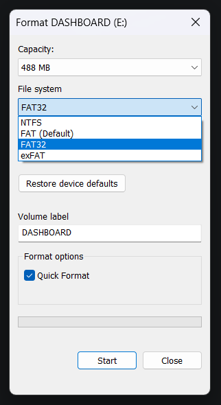

# User Manual
← [Homepage](../)
## 1 Product Overview
### 1.1 Short Description
The dashboard is a user-friendly, customizable, and practical device that displays real-time data for current date and time, weather for a selected location in Germany (DE), and fuel prices for three custom gas stations in Germany (DE). The device features fail-safe mechanisms and user-friendly error messages to operate autonomous without any interaction except initial setup.

<b>In short:</b> 
You live in Germany. This display is for answering the following questions:
- What date and time is right now?
- How is the weather like?
- What is the current fuel price at my favorite gas stations?

Once configured, never touch it again.

### 1.2 Package Contents
- 1x Dashboard
- 1x Touch stylus
- 1x USB-C cable
- 1x SD card
- 1x SD card to USB-C adapter
- 2x screws

### 1.3 Intended Usage and Safety Warnings
This device has only informative character and should not be used in critical applications or scenarios. Please use device as intended - Hanging peacefully on a wall in a room with human-friendly conditions, meaning:
- Not too cold
- Not too hot
- Not too wet
- Not too radioactive
- Not too much sun exposure

Please keep the device and its components away from children and animals - for the well-being of both the device and the fauna. 

<b>Please, don't become the reason this chapter needs to be extended.</b>

## 2 Dashboard Configuration
### 2.1 SD Card Setup
All configurations are stored on the SD card. <i>If you have received an SD card together with the product, please skip to [2.2](#22-tankerkoenig-api-key).</i> To set up the SD card, plug it into your computer (with the adapter) and format it to FAT32 filesystem format. The following animation demonstrates how to format the SD card on a Windows 11 machine:

</img> Correct SD card formatting option

 After this, simply copy all contents from [this folder](../sdcard/) to the root directory of your SD card.

### 2.2 Obtain Tankerkoenig API Key
To be able to display fuel prices and gas station statuses you have to obtain your personal API key [here](https://creativecommons.tankerkoenig.de) for free. Fill out the form and you will receive your API key via email.

### 2.3 Find Gas Station ID's
To find the station ID of a particular gas station you can use [this tool](https://creativecommons.tankerkoenig.de/TankstellenFinder/index.html). It is an interactive map that allows you to find a station and copy its station ID for later usage in [station_ids](#244-station_ids) list.

### 2.4 Configuration Values
All configuration values are stored in the [configuration.json](../sdcard/configuration.json) file. If not done yet, plug in your SD card (with the adapter) into you computer. Open the configuration file with an editor of your choice. In the following subsections every single configuration value is briefly described. You can set the values according to your preferences.

#### 2.4.1 wlan_ssid
<b>Description:</b> WLAN name that the dashboard will connect to 
<b>Necessity:</b> Mandatory 
<b>Configuration Type:</b> Single value 
<b>Value Type:</b> Text 
<b>Constraints:</b>
- Maximum length: 32 characters

#### 2.4.2 wlan_psk
<b>Description:</b> WLAN password that the WLAN requires to connect to it 
<b>Necessity:</b> Mandatory 
<b>Configuration Type:</b> Single value 
<b>Value Type:</b> Text 
<b>Constraints:</b>
- Minimum length: 8 characters
- Maximum length: 63 characters

#### 2.4.3 tankerkoenig_api_key
<b>Description:</b> API key for gas station information access 
<b>Necessity:</b> Mandatory 
<b>Configuration Type:</b> Single value 
<b>Value Type:</b> Text 
<b>Constraints:</b>
- Expected format: `XXXXXXXX-XXXX-XXXX-XXXX-XXXXXXXXXXXX`

#### 2.4.4 station_ids
<b>Description:</b> List of gas station ID's 
<b>Necessity:</b> Mandatory 
<b>Configuration Type:</b> List 
<b>Value Type:</b> Text 
<b>Constraints:</b>
- Expected format: `XXXXXXXX-XXXX-XXXX-XXXX-XXXXXXXXXXXX`
- All station ID's must be unique

#### 2.4.5 station_labels
<b>Description:</b> List with station icon names and labels 
<b>Necessity:</b> Optional 
<b>Configuration Type:</b> List of lists 
<b>Value Type:</b> Text 
<b>Constraints:</b>
- Dimension: 3x3 text values
- In each triplet:
    - 1st row - Station icon file name
    - 2nd row - Custom station label (up to 21 characters)
    - 3rd row - Custom fuel name (up to 21 characters)

#### 2.4.6 fuel_type
<b>Description:</b> Fuel type that the price is displayed for 
<b>Necessity:</b> Mandatory 
<b>Configuration Type:</b> Single value 
<b>Value Type:</b> Text 
<b>Constraints:</b>
- One of the following values:
    - `e5`
    - `e10`
    - `diesel`

#### 2.4.7 weather_lat
<b>Description:</b> Geographical latitude for weather data  location 
<b>Necessity:</b> Mandatory 
<b>Configuration Type:</b> Single value 
<b>Value Type:</b> Decimal number 
<b>Constraints:</b>
- Value must be between -90 and 90

#### 2.4.8 weather_long
<b>Description:</b> Geographical longitude for weather data  location 
<b>Necessity:</b> Mandatory 
<b>Configuration Type:</b> Single value 
<b>Value Type:</b> Decimal number 
<b>Constraints:</b>
- Value must be between -180 and 180

#### 2.4.9 automatic_updates
<b>Description:</b> Flag for automatic firmware updates 
<b>Necessity:</b> Mandatory 
<b>Configuration Type:</b> Single value 
<b>Value Type:</b> Boolean 
<b>Constraints:</b>
- Value must be either `true` or `false`

## 3 Custom Station Icons
### 3.1 Selection from Existing Station Icons
This repository provides a selection of station icons for well-known brands in Germany such as ARAL or SHELL. You can find the selection [here](../stationicons/). Copy the desired station icons (maximum three) into the [station_icons](../sdcard/station_icons/) folder on your SD card. Make sure that you use the corresponding names in [station_labels](#245-station_labels), e.g. if the icon is named `aral.rgb666`, you enter `aral` in your configuration.
### 3.2 Create Custom Station Icons
It is possible to create your own custom station icons. Download or create a PNG file with the station icon. Resize the image to 64x64 pixels. You can use [this online tool](https://www.iloveimg.com/resize-image/resize-png#resize-options,pixels) for free. In your terminal, navigate with `cd` to the [scripts](../scripts/) folder and run the following command:

        python convert png_to_rgb666.py your_icon.png your_icon.rgb666

If you want to add a custom background color, append the color to the previous command in brackets, e.g. for a red background, you would use:

        python convert png_to_rgb666.py your_icon.png your_icon.rgb666 (255, 0, 0)

The resulting icons can be then copied to the [station_icons](../sdcard/station_icons/) folder. Use the file names in the [staion_labels](#245-station_labels) configuration list, as described in [3.1](#31-selection-from-existing-station-icons).

### 3.3 Request a Station Icon
If you don't want to create your own custom icons, you can create a station icon request [here](https://github.com/smolinde/iot-dashboard/issues/new?template=station-icon-request.md). The icon will be then available in the [icon selection](../stationicons/) folder of this repository. However, there is no guarantee that the station icon will be made immediately, so if you want to avoid waiting times, consider following the instructions from [3.2](#32-create-custom-station-icons).

## 4 Finalization and Installation
Insert the SD card into the dashboard. Make two marks on the wall where you want to hang the dashboard. The marks should be 6cm apart each other. Install the two screws that come with the dashboard or use any suitable screws or nails of your choice. Please note that the mounting holes have a diameter of ~7mm. Adjust the screw positions such that the dashboard hangs horizontally. Final step is to plug in the USB-C cable, attach the dashboard to the screws on the wall, and plug in the other end of the cable into a 5V electricity soure (e.g. phone charger). The dashboard should light up immediately and try to connect to the WLAN that you have configured. After that, if the tankerkoenig API key and station ID's are valid, you should see the dashboard displaying everything as expected.

## 5 Troubleshooting
In case of errors the dashboard will always display an error message and a QR code. If you scan the QR code with your smartphone, you will be redirected to one of the [error pages](../errors/). There you will find more details on why the error appeared and how to resolve it. The error codes have the following structure:

- The error code has always four digits, e.g. `1207`
- First digit is either 1 or 2, where:
    - 1 stands for user action required, the error will disappear after user touches the display screen
    - 2 stands for automatic restart of system after error appeared
- Second digit is a number from 1 to 6, where:
    - 1 stands for SD card and file-related errors
    - 2 stands for configuration-related errors
    - 3 stands for wireless connection errors
    - 4 stands for internet connection errors
    - 5 stands for time syncronization errors
    - 6 stands for update-related errors
- Third and fourth digit are the error number, they have no specific meaning and are only for error identification

If we take the example `1207` from above, we can conclude that the error needs manual user confirmation that the error was seen and it is a configuration-related error. Also, a short description is always displayed on-screen, which helps the user most of the times even without the necessity to scan the QR code and read the error page. Under some circumstances, there is a small chance that the error [1000](../errors/1000.md) might appear. This requires further investigation by the maintainer of this project. In that case, take a photo of the error screen as it might include a valuable hint to the error origin and create a new [Error 1000 Report](https://github.com/smolinde/iot-dashboard/issues/new?template=error-1000-report.md) if no similar issue already exists.

## 6 Firmware Updates
In case you set the [automatic_updates](#249-automatic_updates) flag to `false`, your firmware will stay unchanged. It is stronlgy recommended to keep this flag on `true` as the device will receive improvments and bug fixes automatically. There is no user action required for a firmware update. The device checks the server for updates once a day at 03:00 local time, when the user is most likely sleeping. If there is an update (or rollback) available, the device will download it from this repository, validate the contents, and install the new firmware in a matter of less than five minutes. After this, the device will restart and operate as usual. This process is visually displayed on the screen. In case anything goes wrong and an unexpected error occurs, the device will activate deepsleep mode and requires manual maintenance. In this case, feel free to raise a new issue [here](https://github.com/smolinde/iot-dashboard/issues/new?template=BLANK_ISSUE).

## 7 Disposal
Please adhere to current disposal regulations of the [German Federal Environment Agency](https://www.umweltbundesamt.de/). As this is not a commercial product, the responsibility is delegated to the user.

## 8 Warranty and Legal Remarks

This project is provided “as is”, without any express or implied warranties. There is no product warranty and no guarantee of support or updates.

Since this is a non-commercial project, the author assumes no legal responsibility for any damage, malfunction, or loss resulting from the use or misuse of the hardware, software, or documentation.

By using or implementing this project, you acknowledge that you do so at your own risk.

<a href="#hardware-setup">Unscroll this page</a>
